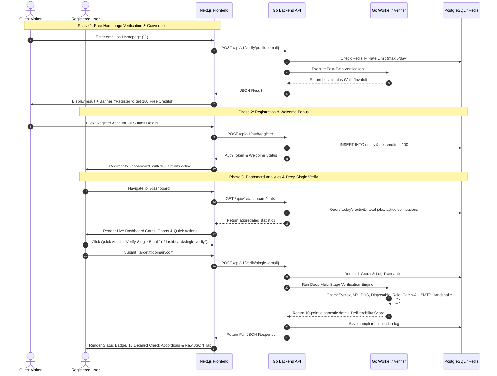

# Email Verification SaaS Tool — System Architecture & Feature Blueprint
**Complete Specification across Frontend, Backend, and Worker Layers**

---

## 1. System Overview & Architecture

The application is architected as a high-performance, three-tier cloud-native platform:
- **Frontend Layer**: Next.js 14+ (App Router, Tailwind CSS, Zustand state management). Delivers a responsive, dynamic UI with real-time status updates and visual verification breakdowns.
- **Backend Layer**: Go REST API (`/api/v1/...`). Handles authentication, role-based access control (RBAC), credit ledger/deductions, rate limiting, and API key management.
- **Worker Layer**: Go Background Processing Engine (`worker/`). Executes high-speed asynchronous DNS/MX queries, SMTP handshakes, catch-all detection, and bulk CSV processing queues without blocking the main API.

---

## 2. Role-Based Access Control (RBAC) & Responsibilities

The system supports multiple distinct user roles, ensuring tailored access, quotas, and feature availability:

| Role | Description | Frontend Permissions & Access | Backend & Worker Privileges |
| :--- | :--- | :--- | :--- |
| **Guest / Public** | Unauthenticated visitors on the homepage. | Can use the free single email check on Home page (limited by IP/Device rate limit). No dashboard access. | Limited to `GET/POST /api/v1/verify/public`. Strict rate-limiting via Redis (e.g., 5 checks/day). |
| **Regular User** | Standard registered SaaS customer. | Access to User Dashboard, Single Verification, Bulk CSV Upload, API Keys, Credit History, and Profile Settings. | Standard verification priority. Deducts credits per verification. Access to standard API endpoints. |
| **Enterprise / VIP** | High-volume client or custom plan user. | All regular features + Priority queue status, Webhook management, Dedicated account limits, and custom integrations. | High-priority Worker execution queue. Higher API rate limits (`/user/keys`). |
| **Reseller** | Partners distributing or sub-leasing credits. | Special **Reseller Portal** (`/dashboard/reseller/transfer`) to transfer credits to sub-accounts, view commission logs, and manage client balances. | Can call credit transfer APIs, query sub-account usage, and provision child API keys. |
| **Super Admin** | Platform owners & system operators. | Full **Admin Dashboard** (`/admin/...`) including User Control, SMTP Configuration, Node/Server Monitoring, Job Control, License, and Cache Control. | Unrestricted access across all internal APIs (`/api/v1/admin/...`), Worker pool control, and system configuration. |

---

## 3. Feature Breakdown & Layer-by-Layer Implementation

### A. Free Homepage Verification & Conversion Funnel (`/`)
*Goal: Allow public visitors to test the accuracy of the verification tool instantly, then incentivize them to register by offering 100 Free Credits.*

1. **Frontend (`frontend/app/page.tsx`)**
   - **Hero Verification Form**: Clean, prominent input box on the homepage (`Verify Instant Free`).
   - **Interactive Results Display**: Shows status badge (*Valid, Invalid, Catch-All, Disposable*) alongside verification speed (e.g., `Checked in 340ms`).
   - **Conversion Banner / CTA**: If the verification succeeds or if the user reaches their daily free limit (`5/day`), a dynamic slide-in alert appears:
     > 🚀 **Satisfied with the accuracy?** [Create your Free Account](#register) today and get **100 Free Verification Credits** instantly added to your balance!

2. **Backend (`backend/internal/api/handlers/public_verify.go`)**
   - Endpoint: `POST /api/v1/verify/public`
   - Checks Redis `rate_limit:ip:{client_ip}`. If count >= limit, returns `429 Too Many Requests` with a prompt to sign up.
   - Forwards request to fast-path verification logic without deducting any user credits.

3. **Worker (`worker/internal/verifier/fast_check.go`)**
   - Performs rapid synchronous checks: Syntax (RFC 5322), Domain DNS/A record, MX record lookup, Disposable domain match against local cache, and Role account check.

---

### B. Account Registration & 100 Free Bonus Credits (`/register`)
*Goal: Seamless onboarding that automatically credits 100 verification units upon successful sign-up.*

1. **Frontend (`frontend/app/register/page.tsx`)**
   - Registration form with Email, Password, Name, and Turnstile/Captcha validation.
   - Upon successful signup, redirects to `/dashboard` where a welcome toast celebrates: *"🎉 Welcome! 100 Free Credits have been deposited into your account."*

2. **Backend (`backend/internal/api/handlers/auth.go`)**
   - Endpoint: `POST /api/v1/auth/register`
   - Creates `users` record in PostgreSQL with default `role = 'user'`.
   - Automatically initializes `user_credits` balance with `100` units (`reason: 'WELCOME_BONUS'`).
   - Issues JWT session token & `user_api_key`.

---

### C. Comprehensive User Dashboard (`/dashboard`)
*Goal: Provide a bird's-eye view of all account metrics, real-time job statuses, and quick action shortcuts.*

```
+-----------------------------------------------------------------------------------+
|  Today's Activity      Total Verifications     Total Jobs        Active Jobs      |
|  🟢 Valid: 45          Total: 12,450           Bulk: 34          Running: 2       |
|  🔴 Invalid: 5         Accuracy: 98.4%         Single: 8,120     Pending: 0       |
+-----------------------------------------------------------------------------------+
|  Lifetime Usage Statistics        |  Quick Actions                            |
|  Credits Remaining: 2,450 / 5,000 |  [⚡ Verify Single Email]  [📁 Upload CSV] |
|  Progress: [=========>      ] 49% |  [🔑 Manage API Keys]      [💳 Buy Credits]|
+-----------------------------------------------------------------------------------+
|  Weekly Activity Trend (7 Days)   |  Recent Activity Feed                     |
|  Mon: |||||||||| 1,200            |  • john.doe@gmail.com -> Valid (2 mins ago)|
|  Tue: |||||| 850                  |  • Bulk Job #1042 (2,000 emails) -> 100%  |
|  Wed: ||||||||||||||| 2,100       |  • support@spam.net -> Invalid (1 hr ago) |
+-----------------------------------------------------------------------------------+
```

1. **Frontend (`frontend/app/dashboard/page.tsx`)**
   - **Today's Activity Card**: Counts valid, invalid, risky, and unknown results verified from 00:00 UTC today.
   - **Total Verifications & Jobs**: All-time verification count + breakdown of Single vs. Bulk jobs.
   - **Active Jobs Tracker**: Live status of currently running CSV/Excel bulk verifications with progress bars (`65% complete`).
   - **Lifetime Usage Statistics**: Total credits purchased vs. consumed, average verification score, and lifetime deliverability rate.
   - **Weekly Activity Chart**: 7-day visual bar/line chart (`Recharts` / `Chart.js` integration).
   - **Recent Activity Table**: Real-time log of the latest 10 verification requests with status badges and timestamp.
   - **Quick Actions Panel**: One-click action buttons directing to `/dashboard/single-verify`, `/dashboard/bulk-upload`, and `/dashboard/api-keys`.

2. **Backend (`backend/internal/api/handlers/dashboard.go`)**
   - Endpoint: `GET /api/v1/dashboard/stats`
   - Aggregates metrics from PostgreSQL (`verifications_history`, `jobs`, `user_credits`) and Redis real-time counters.

---

### D. Deep Single Email Verification (`/dashboard/single-verify`)
*Goal: Offer the most detailed, enterprise-grade email inspection interface, showing precise check-by-check diagnostics and Raw JSON API response.*

#### 1. Frontend UI Breakdown (`frontend/app/dashboard/single-verify/page.tsx`)

- **Single Verify Form**:
  - Input field for target email (`e.g., alex.smith@company.com`).
  - Toggle options: *Run Deep SMTP Probe*, *Check Blacklists*.
  - `[Verify Email]` button with loading spinner.

- **Verification Results Summary Card**:
  - **Status Badge**: `VALID` (Green), `INVALID` (Red), `RISKY / CATCH-ALL` (Yellow), `DISPOSABLE` (Orange).
  - **Quality Score**: Deliverability Score Meter (e.g., `96/100`).
  - **Suggested Action**: e.g., *"Safe to send. Mailbox confirmed active via SMTP handshake."*

- **Detailed Checks Grid (10-Point Diagnostic Breakdown)**:
  Each check is displayed as an expandable card or checklist item with exact technical findings:
  1. **Syntax & Format Check**: Validates `@` placement, domain length, characters according to RFC 5322 (`Passed`).
  2. **Domain & DNS Check**: Verifies existence of domain and root `A` / `AAAA` DNS records (`Passed - company.com exists`).
  3. **MX Records Check**: Verifies mail server routing records and priority weights (`Passed - 5 aspmx.l.google.com`).
  4. **Disposable / Temporary Email**: Checks if the domain belongs to temporary inbox providers like Mailinator, 10MinuteMail (`Passed - Not Disposable`).
  5. **Role-Based Account Check**: Detects if the prefix is generic (`admin@`, `support@`, `billing@`, `info@`) (`Passed - Personal/Corporate Inbox`).
  6. **Free Mail Provider Check**: Identifies if hosted on free public servers like Gmail, Yahoo, Outlook (`Passed - Custom Corporate Domain`).
  7. **Catch-All / Accept-All Server**: Probes if the target domain accepts emails sent to any random/non-existent username (`Passed - No Catch-All detected`).
  8. **SMTP Handshake & Mailbox Existence**: Connects to the mail server on Port 25/587 and executes `HELO`, `MAIL FROM`, and `RCPT TO` commands to confirm if the exact recipient inbox exists (`Passed - RCPT TO accepted`).
  9. **SPF, DKIM & DMARC Posture**: Checks if the receiving domain has properly configured email security authentication policies (`Passed - SPF & DMARC enforced`).
  10. **Spam Trap / Blacklist Check**: Cross-references domain against known spam honeypots and DNSBL blacklists (`Passed - Clean`).

- **Raw JSON Response Tab / Modal**:
  Allows developers to inspect the exact API payload for easy integration into their custom software:
  ```json
  {
    "status": "success",
    "data": {
      "email": "alex.smith@company.com",
      "user": "alex.smith",
      "domain": "company.com",
      "verification_status": "valid",
      "deliverability_score": 96,
      "reason": "accepted_email",
      "checks": {
        "syntax_valid": true,
        "domain_exists": true,
        "mx_records_found": true,
        "mx_records": [
          { "host": "aspmx.l.google.com.", "priority": 1 }
        ],
        "is_disposable": false,
        "is_role_account": false,
        "is_free_email": false,
        "is_catch_all": false,
        "smtp_handshake": {
          "status": "success",
          "code": 250,
          "message": "2.1.5 OK alex.smith@company.com",
          "latency_ms": 184
        },
        "dns_security": {
          "spf_record": true,
          "dmarc_record": true
        },
        "is_blacklisted": false
      },
      "verified_at": "2026-07-09T15:26:00Z"
    }
  }
  ```

#### 2. Backend API (`backend/internal/api/handlers/single_verify.go`)
- Endpoint: `POST /api/v1/verify/single`
- Headers Required: `Authorization: Bearer {apiKey}` or `Cookie: user_session`
- Flow:
  1. Checks if user balance `>= 1 credit`.
  2. Deducts `1 credit` from user ledger in PostgreSQL (`BEGIN TRANSACTION...`).
  3. Calls internal synchronous/async verification engine.
  4. Records full diagnostic result into `verifications_history` table.
  5. Returns structured JSON payload to client.

#### 3. Worker Engine (`worker/internal/engine/deep_inspect.go`)
- Orchestrates concurrent network checks using Go goroutines with strict timeout contexts (`context.WithTimeout(ctx, 4*time.Second)`):
  - Goroutine 1: DNS & MX lookup (`net.LookupMX`).
  - Goroutine 2: Redis cache lookup for known disposable/free domains.
  - Goroutine 3: SMTP Handshake worker (connects to target MX host, initiates TLS/STARTTLS, performs `RCPT TO` check without completing data transfer).

---

## 4. End-to-End User Journey Walkthrough



---

## 5. High-Concurrency Bulk Processing & Fair-Share Queueing Architecture
*What happens when 10 different users upload bulk verification CSV files simultaneously at the exact same time?*

### A. The Head-of-Line Blocking Problem (Why pure FIFO fails)
If User 1 uploads a CSV with **100,000 emails** and Users 2 through 10 right after upload files with **500 emails** each:
- **If Pure FIFO (First-In-First-Out) is used**: The worker would spend hours finishing User 1's 100,000 emails before touching User 2. Users 2-10 would experience severe delays for tiny files.
- **If Uncontrolled Simultaneous Concurrency is used**: Processing 1,000,000 emails instantly across 10 jobs would crash server RAM/network ports and trigger immediate IP blacklisting by target SMTP providers (Gmail, Microsoft, Yahoo).

### B. The Production Architecture: Chunked Fair-Share Round-Robin & Priority Pools
To ensure fast, equitable, and safe processing when multiple users upload files simultaneously, our **Go Worker Layer (`worker/`)** implements **Chunked Fair-Share Dispatching**:

1. **Job Ingestion & Chunking (Slicing)**:
   - When 10 CSV files are uploaded via `POST /api/v1/jobs/upload`, the backend immediately accepts all 10 files and splits each large list into smaller **Chunks / Batches** (e.g., 200 emails per chunk) stored in Redis / RabbitMQ queues.

2. **Role-Based Priority Bucketing**:
   - **VIP / Enterprise Users**: Chunks enter the `high-priority` queue (processed by 60% of total worker goroutines).
   - **Regular Users**: Chunks enter the `standard-priority` queue (processed by 40% of total worker goroutines).

3. **Fair-Share Round-Robin Worker Pool (Concurrency Across All Users)**:
   Instead of finishing Job 1 entirely before starting Job 2, the **Go Worker Pool** (e.g., 50 concurrent goroutines) pulls chunks across all active user jobs in a **Round-Robin loop**:
   - Worker Goroutine #1 -> Processes Chunk 1 of User 1 (200 emails)
   - Worker Goroutine #2 -> Processes Chunk 1 of User 2 (200 emails)
   - Worker Goroutine #3 -> Processes Chunk 1 of User 3 (200 emails)
   - ...and so on across all 10 simultaneous users!

### C. Result & User Experience Benefits
- **No Waiting in Line**: All 10 users see their progress bar immediately start moving (`Active Jobs: 10% -> 25% -> 40%`) within seconds of uploading.
- **Small Jobs Finish Fast**: Users 2-10 (with 500 emails each) finish complete verification within minutes, while User 1's massive 100,000 email job continues smoothly in parallel.
- **Zero IP Blacklisting & Rate-Limit Protection**: The worker enforces per-domain rate limiters (`golang.org/x/time/rate`) so that no single destination mail server (e.g., `gmail-smtp-in.l.google.com`) is bombarded simultaneously.

