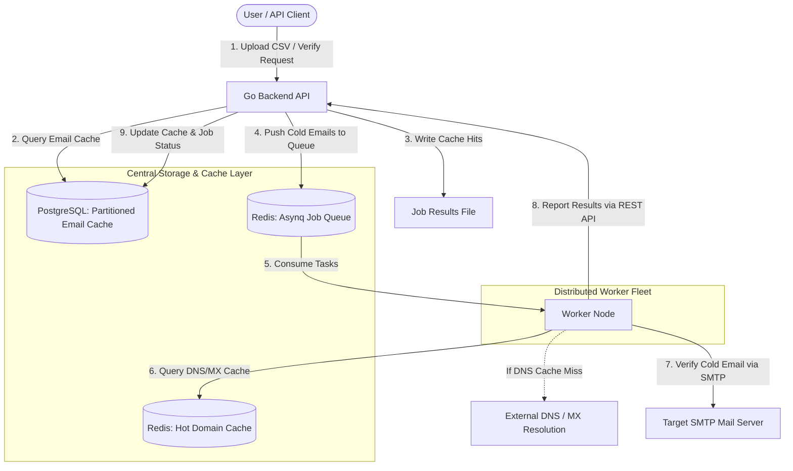

# Hybrid Cache Architecture Design

This document details the Hybrid Cache Architecture for **EmailJachai-Pro (EJP)**. To support billions of email verifications, the system employs a decoupled, multi-tiered caching strategy designed to maximize throughput, minimize database connection bottlenecks, and reduce worker CPU/network overhead.

---

## 1. Architecture Overview

Rather than using a single database or caching strategy for both domain and email verifications, we split them based on their data size, update frequency, and performance requirements.



---

## 2. Detailed Caching Strategies

### 2.1 Domain Cache (MX & DNS Records)
*   **Storage Medium:** Redis (In-Memory Key-Value Store) & Worker Memory (`go-cache`).
*   **Rationale:** The number of active domains globally is relatively small (under a few hundred million), and MX/DNS records change infrequently. Querying external DNS for every email is slow and prone to rate-limiting/throttling.
*   **Structure (`domain_cache`):**
    ```json
    {
      "domain": "gmail.com",
      "mx_records": ["gmail-smtp-in.l.google.com."],
      "dns_status": "valid",
      "is_catch_all": true,
      "updated_at": 1780704000
    }
    ```
*   **Retrieval:** Workers query Redis first. Top-10,000 domains (like `gmail.com`, `yahoo.com`, `outlook.com`) can be cached in the worker's local RAM for instant lookup.

### 2.2 Email Cache (Verification Results)
*   **Storage Medium:** PostgreSQL (Partitioned Tables by month).
*   **Rationale:** Email records can grow into billions. Storing billions of records in Redis is extremely expensive (RAM-heavy). PostgreSQL handles indexed relational data efficiently.
*   **Structure (`email_cache`):**
    ```json
    {
      "email": "user@example.com",
      "status": "valid",
      "score": 95,
      "detailed_checks": {
        "syntax": true,
        "mx_valid": true,
        "smtp_handshake": "deliverable",
        "disposable": false
      },
      "created_at": "2026-06-05T02:00:00Z"
    }
    ```
*   **Partitioning Strategy:** The table is partitioned by `created_at` (Monthly partitions). This keeps indexes compact, guarantees fast lookup speeds, and allows simple partition drops for old data deletion.

---

## 3. Verification Lifecycle & Data Flow

### Step 1: Bulk Upload & Asynchronous Pre-Checking (Cache Hits)
When a user uploads a CSV of 1,000,000 emails:
1.  **Go Backend** validates the file, creates a Job ID, and returns success to the user instantly to prevent HTTP timeouts.
2.  An internal background routine in the Backend reads the CSV in chunks.
3.  This routine executes a bulk query against `email_cache` (e.g., `SELECT * FROM email_cache WHERE email IN (...)`).
4.  Any matching emails (with valid retention periods) are written **directly** to the job's result file (e.g., `.ndjson` on S3/Local Storage).
5.  **No tasks are queued** to the external worker fleet for these cached emails.

### Step 2: Queueing Cold Emails
1.  Only emails that **missed** the cache are pushed into the **Redis (Asynq) Queue**.
2.  This drastically reduces queue size and saves worker processing capacity.

### Step 3: Worker Execution & Reporting
1.  Workers pull cold emails from the queue.
2.  Workers first query their **Local In-Memory Cache (LRU/Ristretto)** for top domains (e.g., gmail.com, yahoo.com). If not found locally, they query **Redis**.
3.  If neither cache has the domain, workers perform external DNS/MX resolution, save the new domain info to Redis, and cache it locally.
4.  Workers perform the SMTP handshake check.
5.  Workers post the results back to the Backend API.
6.  Backend writes the final results to the job file and upserts the results into the `email_cache` table for future requests.

---

## 4. Cache Retention & Configurable TTL

To satisfy different customer accuracy requirements, the cache query implements a dynamic TTL filter based on user-requested settings (7, 14, 21, 30, 45, or 60 days).

| Configured Age (TTL) | Database SQL Filter Clause | Use Case |
| :--- | :--- | :--- |
| **7 Days** | `AND created_at >= NOW() - INTERVAL '7 days'` | High-accuracy marketing campaigns. |
| **30 Days** | `AND created_at >= NOW() - INTERVAL '30 days'` | Standard business leads. |
| **60 Days** | `AND create_at >= NOW() - INTERVAL '60 days'` | Budget verification / cold lists. |

### Sample Database Query:
```sql
SELECT email, status, score, detailed_checks, created_at
FROM email_cache
WHERE email = $1
  AND created_at >= NOW() - CAST($2 AS INTERVAL);
```
*(where `$2` is the user-configured retention string e.g., `'30 days'`)*

---

## 5. Architectural Benefits

1.  **Network Bandwidth Savings:** Workers never download or sync the entire cache database. They only pull tasks they actually need to verify.
2.  **Stateless Worker Fleet:** Workers remain lightweight, stateless, and horizontally scalable.
3.  **Low Latency Bulk Verification:** Up to 70-80% of typical email lists consist of repeated domains and previously verified addresses. Pre-checking cache on the backend reduces queue processing times from hours to seconds for those segments.
4.  **Resource Efficiency:** Storing hot domain records in Redis and long-term email records in partitioned PostgreSQL balances speed and memory costs optimally.

---

## 6. Future Scaling Considerations (Phase 2)

When the platform scales to billions of cached emails and massive daily throughput, the following components will be introduced:

### 6.1 Redis Bloom Filters
Before executing PostgreSQL queries for cache hits, the backend will consult a Redis Bloom Filter to check if an email exists in the system. If the Bloom filter returns "No", the database query is skipped entirely, reducing DB read load by 60-80% for cold lists.

### 6.2 Database Migration (ScyllaDB / ClickHouse)
While PostgreSQL Partitioning handles hundreds of millions of rows efficiently, reading/writing billions of flat key-value email records can eventually cause I/O bottlenecks. In the future, the `email_cache` will be migrated to a high-performance NoSQL (e.g., ScyllaDB) or Columnar (e.g., ClickHouse) database optimized for billion-row scale.
