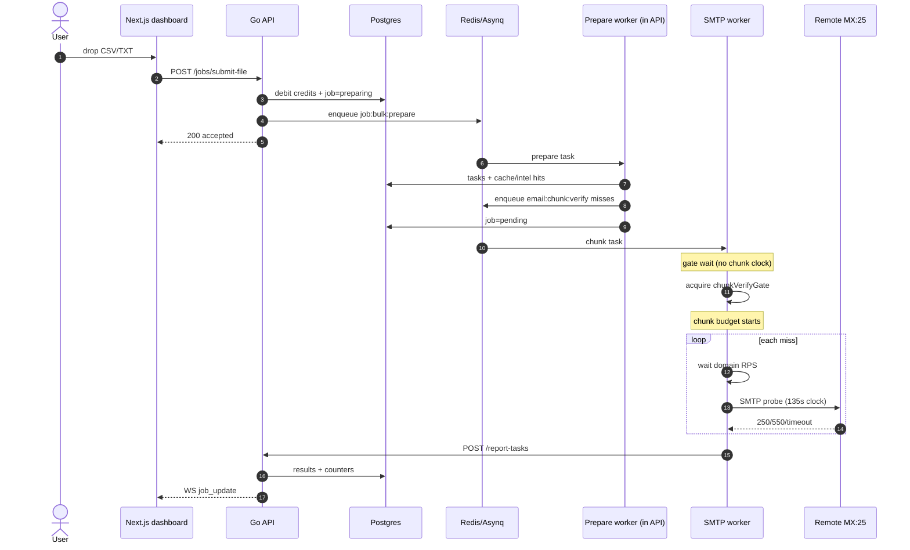
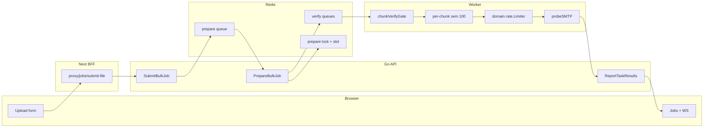

# Bulk Upload Pipeline — How The System Works

This document describes the **live bulk-upload path** as implemented in this repo.
Use it to improve one layer at a time without mixing clocks, queues, or credit rules.

**Out of scope (do not mix with bulk):**

- Dashboard **single verify** and homepage **public verify** run inside the API process (`verifier.VerifyEmailBounded` + `smtpSem`). They do **not** use Asynq chunks or `chunkVerifyGate`.
- Auth, payments, and admin UI are mentioned only where they touch bulk.

**Source of truth:** code + Job Control settings. Numbers below are defaults; Admin → Job Control can override the marked ones.

---

## 1. 1D flow (time order)

Read this top to bottom. Each stage starts only after the previous one succeeds (or short-circuits).

```text
 0  User picks CSV/TXT (≤200MB) on /dashboard/bulk-upload
 1  Soft credit check in browser (≥1 credit)
 2  POST multipart → Next BFF → Go API
 3  Parse + dedupe emails (handler + service)
 4  Redis ping + idempotency lock
 5  Atomic credit debit + job row status=preparing
 6  Persist source file (+ Redis backup)
 7  Enqueue Asynq job:bulk:prepare (queue=prepare)
 8  HTTP 200 “accepted” — UI shows preparing
 9  Prepare worker: cluster slot + per-job lock
10  Reload source → syntax filter → shuffle → dynamic chunks
11  Create job_tasks (queued)
12  Classify each email: EmailCache → Domain Intel → SMTP miss
13  Enqueue SMTP misses (Asynq email:chunk:verify)
14  Write cache/intel hits into job_results
15  Job status preparing → pending
16  Webhook job.started (if configured)
17  Worker dequeues chunk (Asynq pool)
18  Wait chunkVerifyGate (Job Control worker_concurrency)  ← chunk clock NOT running
19  Start Job Control chunk budget (15/60/120 min)
20  Per email: MX → domain rate-limit wait → 135s SMTP probe
21  POST /internal/report-tasks
22  Backend upserts results, cache, NDJSON, WS job_update
23  When processed_count ≥ total_emails → completed
24  100% credit refund for status=unknown (risky)
25  Webhook + email job.completed
```



---

## 2. 2D map (layer × stage)

Rows = **where it runs**. Columns = **what it does**. Empty cell = that layer is idle.

| Layer | Accept | Prepare | Queue | Verify | Report | Finish |
| :--- | :--- | :--- | :--- | :--- | :--- | :--- |
| **Browser** | File pick, idempotency UUID, optimistic credit | — | — | — | WS / jobs page | Download NDJSON/CSV |
| **Next BFF** | Auth cookie → Bearer, stream body | — | — | — | Proxy GETs | — |
| **Go API HTTP** | Parse file, limits, `SubmitBulkJob` | — | Enqueue prepare | — | `ReportTaskResults` | Risky refund, webhook |
| **Go prepare worker** | — | Shuffle, chunk, classify, enqueue SMTP | — | — | Cache-hit rows | — |
| **Asynq / Redis** | Idempotency key, source backup | `prepare` queue + locks | `critical/default/low` | Hang timeout | — | Dead-letter |
| **Postgres** | Job + txn + credits | `job_tasks` | — | — | `job_results` + counters | Status completed/failed |
| **Disk** | `{job}_source.txt` | Read source | — | — | Append NDJSON | Download |
| **SMTP worker** | Heartbeat pulls Job Control | — | Dequeue chunk | Gate + RPS + probe | HTTP report | DLQ unknowns |
| **Remote MX** | — | — | — | SMTP banner/MAIL/RCPT | — | — |



---

## 3. Accept path (upload → `preparing`)

### 3.1 UI

| Item | Value | File |
| :--- | :--- | :--- |
| Page | `/dashboard/bulk-upload` | `frontend/app/(dashboard)/dashboard/bulk-upload/page.tsx` |
| Form | CSV/TXT, 200MB, maintenance guard | `frontend/features/bulk-upload/components/form.tsx` |
| Endpoint used | `POST /next-api/proxy/jobs/submit-file` | same form (raw `fetch`, **no axios timeout**) |
| Unused twin | `frontend/app/next-api/jobs/submit-file/route.ts` | dedicated route exists; form does **not** call it |
| Idempotency | UUID per file selection; retries reuse it | form `idempotencyKeyRef` |
| Optimistic UI | Deduct `queued` credits, insert recent job `preparing` | dashboard + credit stores |

### 3.2 HTTP

| Item | Value | File |
| :--- | :--- | :--- |
| Routes | `POST /api/v1/jobs/submit` and `/jobs/submit-file` | `backend/internal/routes/api.go` |
| Handler | `JobHandler.SubmitBulkJob` | `backend/internal/api/handler/file_job.go` |
| Body cap | 200MB `MaxBytesReader` | same |
| JSON API | `{ emails[], idempotencyKey }` also accepted | same handler |
| Parse | Header-aware CSV/TXT, named `email` column, delimiter detect | `extractEmailsFromReader` |
| Dedupe #1 | Streaming `seen` map while parsing | handler |
| Dedupe #2 | Again in `SubmitBulkJob` | service |

### 3.3 Accept business rules

`jobService.SubmitBulkJob` (`backend/internal/service/job_service.go`):

1. Unique lowercase emails.
2. Cap `max_emails_per_job` (default **100000**).
3. Redis `SETNX idempotency:job:{userID}:{key}` TTL **60s** (`in_progress`), then store `job_id` for **24h**.
4. Syntax pre-filter: must contain `@` and `len >= 5`. Failures increment `invalid_syntax`, **not charged**.
5. Redis must ping; else refuse (queue down).
6. `CreateBulkJob` (one Postgres txn):
   - Active bulk jobs in `preparing|pending|processing` vs `max_active_jobs_per_user`.
   - `UPDATE users SET credits = credits - queued WHERE credits >= queued`.
   - Usage txn `type=bulk_verify`.
   - Job `status=preparing`, `processed_count = invalid_syntax`.
7. Write `{BULK_SOURCE_PATH}/{jobID}_source.txt` + Redis copy **48h**.
8. Enqueue `job:bulk:prepare`, queue `prepare`, MaxRetry **5**, Timeout **2h**, TaskID `prepare:{jobID}`.
9. WS `user_update` credits + dashboard invalidate.

If source write or prepare enqueue fails → **full refund** of `queuedCount`, job failed.

HTTP returns immediately:

```json
{
  "jobId": "job_…",
  "total": 1000,
  "queued": 980,
  "pre_filtered": 20,
  "duplicates_removed": 50,
  "status": "preparing"
}
```

`queued` is what was charged. `total` is unique rows including invalid syntax.

---

## 4. Prepare path (`preparing` → `pending`)

Runs **inside the API process**, not the SMTP worker.

| Control | Default | Cap | What it limits |
| :--- | ---: | ---: | :--- |
| Asynq prepare pool | 10 | 10 | `prepareAsynqMaxConcurrency` |
| `prepare_concurrency` | 1 | 10 | Redis cluster slot — how many jobs prepare at once across replicas |
| Per-job lock | `bulk:prepare:lock:{jobID}` | TTL 30m, refresh 2m | Two prepares cannot mutate the same job |

Files: `backend/internal/service/prepare_worker.go`, `prepare_lock.go`, `PrepareBulkJob`.

Idempotent:

- `pending|processing|completed|failed` → no-op (stops retries).
- Only `preparing` continues.
- Status stays `preparing` until **all** SMTP chunks are enqueued (crash mid-enqueue must retry, not skip).

### 4.1 Shuffle + chunk

`pipeline.PrepareQueue` (`backend/internal/pipeline/bulk.go`):

1. **AdaptiveShuffle** — group by domain, shuffle domains and mailboxes, then round-robin so one MX is not consecutive.
2. **BuildDynamicChunks** — target size from Job Control tier, then shrink:
   - ≤2 unique domains in window → `base/4`
   - ≤10 unique domains → `base/2`
   - ≥50% free-mail providers → `base/2`
   - floor `MinChunkSize=50` (or 50 if base &lt; 50)
   - **MaxPerDomain** = `clamp(base/10, 25, 100)` so one domain cannot fill a whole chunk

### 4.2 3-tier Job Control (list size → chunk size + timeout)

`getChunkStrategyForList(len(queueEmails))`:

| Tier | List size (default) | Chunk size | Chunk timeout |
| :--- | :--- | ---: | :--- |
| 1 | ≤ 50,000 | 100 | **15 min** |
| 2 | ≤ 100,000 | 500 | **60 min** |
| 3 | else | 1000 | **120 min** |

Settings keys: `chunk_tier{1,2,3}_{max_list,size,timeout}` (timeout unit = **minutes**).

Warmup: if **every** enabled worker has warmup on, chunk size is capped by the least-restrictive warmup age/mode. One full-capacity worker disables that cap.

### 4.3 Classify (no SMTP yet)

Per chunk email, first match wins:

```text
EmailCache (retention TTL)  →  Domain Intelligence  →  SMTP miss
```

| Source | When | Result | SMTP? |
| :--- | :--- | :--- | :--- |
| `email_caches` | Within `b2b_retention` / `free_valid_retention` / `free_invalid_retention` (defaults 30 / 365 / 30 days) | Copy cached row | No |
| `domains` table | type `disposable` | status disposable, score 10 | No |
| `domains` table | type `spam-trap` / `blacklist` | status invalid | No |
| `domains` type `free` or known free list | Informational `is_free` | Still a miss | **Yes** |
| else | — | miss list | Yes |

`ResolveDomainIntel` never skips SMTP for free mailboxes.

### 4.4 Enqueue order (crash-safe)

1. Plan hits vs misses (no writes).
2. Enqueue **all misses first**. Failure → delete those Asynq IDs + **full job refund**.
3. Persist hits via `processCacheHits`. Failure → delete Asynq IDs + delete those hit rows + refund.
4. Only then `status=pending`.
5. Optional webhook `job.started` on queue `low`.

Asynq verify enqueue:

| Field | Value |
| :--- | :--- |
| Type | `email:chunk:verify` |
| Payload | `{ job_id, task_id, emails: misses, chunk_timeout_sec }` |
| Queue | `critical` (admin/manager/reseller), `default` (user), `low` (demo) |
| Worker weights | critical 6 / default 3 / low 1 |
| MaxRetry | 3 |
| Asynq `Timeout` | **chunkTimeout + 4 hours** (hang safety, includes gate wait) |
| Real budget | `chunk_timeout_sec` **after** gate acquire |

All-hit job: no SMTP tasks; hits alone can complete the job (and trigger risky refund if any unknown cache rows).

---

## 5. Semaphores, gates, limiters

**Do not treat these as one knob.** Each protects a different resource.

### 5.1 Bulk SMTP worker (the list you uploaded)

```text
Asynq pool (100)
    └─ many chunk tasks may be "active" in Asynq
         └─ chunkVerifyGate (worker_concurrency, default 10)
              └─ only N chunks run SMTP at once per worker process
                   └─ per-chunk chan sem (100)
                        └─ in-flight TCP probes inside that chunk
                             └─ per-domain rate.Limiter
                                  └─ Wait() then 135s probe clock
```

| # | Name | Scope | Limit | Protects | Clock? | Code |
| ---: | :--- | :--- | :--- | :--- | :--- | :--- |
| 1 | Asynq `Concurrency` | One worker process | **100** fixed (`AsynqPoolCeiling`) | How many Asynq handlers can be scheduled | No | `worker/pkg/config/config.go` |
| 2 | `chunkVerifyGate` | One worker process | Job Control `worker_concurrency` (1–100, default **10**) | How many **chunks** actually verify | **No** — wait is outside chunk budget | `worker/internal/queue/concurrency_gate.go` |
| 3 | Per-chunk `sem` | One chunk handler | **100** | Concurrent `net.Dial` inside the chunk | Yes — after gate | `HandleEmailChunkTask` |
| 4 | Domain `rate.Limiter` | One worker process, per domain | B2B **2 rps / burst 4**; free **1 rps / burst 2** | MX politeness / block avoidance | **No** — wait is outside 135s | `worker/internal/engine/ratelimit.go` |
| 5 | Chunk `context.WithTimeout` | One chunk after gate | Tier 15/60/120 min | Job Control SLA | Yes | handlers.go |
| 6 | Probe deadline | One email after RPS wait | **135s** (env below 135 ignored) | Slow/dead MX | Yes | `engine/smtp.go` |
| 7 | Dial / IO | One TCP session | Dial **24s**, IO **30s** (clamped to remaining probe) | Hung banner/RCPT | Nested in 6 | `probeSMTP` |
| 8 | Asynq task Timeout | One Asynq task including gate wait | chunk + **4h** | Stuck handler / lost worker | Hang only | `enqueueBulkChunks` |

Heartbeat: worker POST heartbeat receives `worker_concurrency` and calls `SetEffectiveWorkerConcurrency`. Changing Job Control does **not** require worker restart; it changes the gate limit live.

### 5.2 Prepare (API side)

| Name | Limit | Protects |
| :--- | :--- | :--- |
| Prepare Asynq pool | 10 | Local prepare goroutines |
| Redis prepare slot | `prepare_concurrency` (1–10) | Cluster-wide simultaneous prepares |
| Per-job Redis lock | 1 | Double-prepare of same `job_id` |

### 5.3 Not used by bulk

| Name | Used by | Limit |
| :--- | :--- | :--- |
| `smtpSem` | Single + public verify **in API** | `SMTP_MAX_CONCURRENT` default **25** |

Changing `SMTP_MAX_CONCURRENT` does **not** change bulk throughput.

### 5.4 Extra backend rate limiters (HTTP, not SMTP)

Gin middlewares rate-limit API keys / public verify. They do not throttle worker SMTP.

---

## 6. Clock model (what starts when)

```text
Upload HTTP
  └─ no verify clock (parse + debit only)

Prepare Asynq (2h)
  └─ shuffle/classify/enqueue only

Asynq verify Timeout = chunk + 4h
  ├─ includes Redis wait + chunkVerifyGate.Acquire()
  └─ must NOT be used as the Job Control SLA

chunkVerifyGate.Acquire()  ← ── chunk budget STARTS HERE
  └─ ctx = WithTimeout(asynqCtx, 15|60|120 min)
       ├─ spawn emails (sem 100)
       └─ per email:
            MX lookup          (not 135s)
            WaitDomainRateLimit(ctx)   ← 135s NOT running
            verifyStart := now         ← 135s STARTS HERE
            probeSMTP until min(135s, remaining chunk ctx)
```

If the chunk budget expires:

- Stop spawning new emails.
- In-flight probes see `ctx` cancel → `cancelled` or shortened deadline → `timeout`.
- Unstarted emails reported as `unknown` / reason `timeout`.
- Handler **returns nil** after report → **no Asynq retry** (retry would multiply the SLA × up to 4).
- Those unknowns count as `risky` → refunded at job complete.

If Asynq parent ctx dies (shutdown / hang timeout): return error, no report → retry / DLQ.

---

## 7. One email inside the worker

`engine.VerifyEmail(ctx, email)` (`worker/internal/engine/smtp.go`):

```text
normalize
  ├─ bad syntax            → invalid
  ├─ domain cache disposable → disposable
  ├─ spam-trap / blacklist → invalid
  ├─ MX miss               → invalid reason=mx
  ├─ WaitDomainRateLimit   → cancelled | rate_limit_timeout
  └─ probe up to 5 MX
        ├─ RCPT 250 + catch-all RCPT 250 → catch_all (55)
        ├─ RCPT 250                      → valid (100)
        ├─ 552 / over quota              → valid + mailbox_full
        ├─ 550/551/553                   → invalid rejected
        ├─ deadline                      → unknown timeout
        └─ else                          → unknown smtp
```

`rate_limit_timeout` only if `Wait` fails **without** `ctx.Err()` (should be rare now; wait is unbounded until parent ctx).

---

## 8. Report + finish

Worker `ReportBatchToAPI` → `POST {API_BASE_URL}/report-tasks` (30s HTTP client).

Backend `workerService.ReportTaskResults`:

1. Worker `server_name` must be registered **and enabled**.
2. Ignore if job already `failed|cancelled`.
3. Re-apply domain policy (disposable/spamtrap/blacklist) so a stale worker cannot mark a trap valid.
4. `NormalizeVerificationStatus` + `PromoteMailboxFullToValid`.
5. Insert `job_results` (skip duplicates).
6. Increment job counters; `status = completed` when `processed_count + n >= total_emails`.
7. Update task `pushed_count` / `completed`.
8. Upsert `email_caches`.
9. `CheckAndApplyRiskyRefund`.
10. Append NDJSON under `BULK_RESULTS_PATH`.
11. WS `job_update` + optional `job.completed` webhook/email.

### 8.1 Status buckets (job counters)

| SMTP / classify status | Job counter | Typical credit |
| :--- | :--- | :--- |
| `valid` | deliverable | charged (kept) |
| `invalid` | undeliverable | charged (kept) |
| `catch_all` | catch_all | charged (kept) |
| `disposable` | disposable | charged (kept) |
| `unknown` (timeout, smtp, cancelled, DLQ) | **risky** | **100% refund at complete** |
| syntax fail at accept | invalid_syntax + undeliverable | **not charged** |

`role` is a flag, not a status. `mailbox_full` is stored as **valid**.

### 8.2 Dead letter

After Asynq MaxRetry exhausted, `HandleDeadLetterTask` reports every email in the chunk as `unknown` / `worker_chunk_failed: …` so the job can still complete and refund those as risky.

---

## 9. State machines

### Job

```text
                    ┌──────────── accept ────────────┐
                    ▼                                │
              preparing ──prepare fail / refund──► failed
                    │
                    │ all chunks enqueued
                    ▼
                 pending
                    │
                    │ first result or hit write
                    ▼
               processing ◄──────── more reports
                    │
                    │ processed_count ≥ total_emails
                    ▼
               completed ── risky refund if Risky>0
```

`CreateBulkJob` with `queuedCount==0` goes straight to `completed`.

### Task (`job_tasks`)

```text
queued → processing → completed
                  ↘ failed   (job refund / prepare rollback)
```

`StartIndex`/`EndIndex` refer to the **shuffled** slice, not the original file order.

---

## 10. Credits (do not mix with single-verify refund)

| Event | Credits |
| :--- | :--- |
| Accept | `−queued` (`@` + len≥5 uniques) |
| Prepare/enqueue hard fail | `+queued` full refund, job `failed` |
| Source missing | same |
| Job completes with `unknown` rows | `+Risky` once (idempotent via txn description LIKE job_id) |
| `timeout` / `cancelled` in bulk | become `unknown` → covered by risky refund |
| Single verify timeout | immediate 1-credit refund (different path) |

Charged emails that come back `valid|invalid|catch_all|disposable` are **not** refunded.

---

## 11. Realtime UI

After accept, user leaves the upload page. Progress is:

- Jobs table + job details
- WS `job_update` (`use-jobs-web-socket` / dashboard store)
- `user_update` when credits change (debit, full refund, risky refund)

---

## 12. Failure matrix (what the user sees)

| Failure | Job | Credits | SMTP? |
| :--- | :--- | :--- | :--- |
| Bad file / no emails | no job | none | no |
| Insufficient credits | no job | none | no |
| Too many active jobs | no job | none | no |
| Redis down at accept | no job | none | no |
| Duplicate idempotency | existing job | none extra | — |
| Source write fail | failed | full refund | no |
| Prepare exhausted retries | failed | full refund | no |
| Mid-enqueue fail | failed | full refund + cancel Asynq | no |
| Chunk budget exceeded | continues | unknowns refunded at end | partial |
| Worker disabled | report rejected | job can stall | maybe |
| Worker crash mid-chunk | Asynq retry or DLQ unknowns | DLQ → risky refund | retry |

---

## 13. Job Control + env knobs (safe improvement surface)

Tune here first; they are already wired.

### Admin → Job Control

| Key | Default | Effect |
| :--- | ---: | :--- |
| `worker_concurrency` | 10 | Chunks verifying in parallel **per worker process** |
| `prepare_concurrency` | 1 | Simultaneous prepares cluster-wide |
| `chunk_tier*_size` | 100 / 500 / 1000 | Base chunk size before dynamic shrink |
| `chunk_tier*_timeout` | 15 / 60 / 120 min | Chunk budget after gate |
| `chunk_tier*_max_list` | 50k / 100k / 500k | Which tier a job uses |
| `max_emails_per_job` | 100000 | Accept cap |
| `max_active_jobs_per_user` | (setting) | Concurrent bulk jobs |
| Cache retention keys | 30 / 365 / 30 days | Hit rate vs freshness |

### Worker / API env

| Key | Default | Notes |
| :--- | :--- | :--- |
| `SMTP_VERIFY_TIMEOUT_SEC` | 135 | Floor 135; only raise |
| `SMTP_DOMAIN_RPS` / `BURST` | 2 / 4 | Per-domain B2B |
| `SMTP_FREE_DOMAIN_RPS` / `BURST` | 1 / 2 | Gmail/Yahoo/… |
| `SMTP_MAX_CONCURRENT` | 25 | **API single/public only** |
| `BULK_SOURCE_PATH` | `./storage/jobs/bulk` | Source txt |
| `BULK_RESULTS_PATH` | `./storage/results/bulk` | NDJSON |

Raising `worker_concurrency` without lowering domain RPS will hammer popular MX and increase `unknown smtp`.

---

## 14. File map

| Stage | Path |
| :--- | :--- |
| UI | `frontend/features/bulk-upload/components/form.tsx` |
| BFF (used) | `frontend/app/next-api/proxy/[...slug]/route.ts` |
| BFF (unused twin) | `frontend/app/next-api/jobs/submit-file/route.ts` |
| Accept HTTP | `backend/internal/api/handler/file_job.go` |
| Accept + prepare + enqueue | `backend/internal/service/job_service.go` |
| Prepare consumer | `backend/internal/service/prepare_worker.go` |
| Locks / slots | `backend/internal/service/prepare_lock.go` |
| Shuffle / chunks / queue name | `backend/internal/pipeline/bulk.go` |
| Domain intel | `backend/internal/pipeline/domain_intel.go` |
| Task payload | `backend/internal/tasks/payloads.go` |
| Job / task models | `backend/internal/model/job.go`, `job_task.go` |
| Credits + risky refund | `backend/internal/repo/job_repo.go` |
| Worker report | `backend/internal/service/worker_service.go` |
| Chunk handler + DLQ | `worker/internal/queue/handlers.go` |
| Gate | `worker/internal/queue/concurrency_gate.go` |
| SMTP + clocks | `worker/internal/engine/smtp.go` |
| Domain RPS | `worker/internal/engine/ratelimit.go` |
| Report HTTP | `worker/internal/reporter/reporter.go` |

---

## 15. Improvement notes (from this design, not guesses)

Keep changes inside one cell of the 2D map when possible.

1. **Throughput** — `worker_concurrency` × number of worker processes × domain RPS. Gate is per process, not cluster-wide. Two workers with concurrency 10 ≈ 20 chunks, not 10.
2. **Quality vs speed** — lowering domain RPS reduces blocks; raising chunk timeout reduces `unknown timeout` on slow MX, not on greylisting.
3. **Cache** — higher hit rate skips SMTP and still charges (except later unknown). Shorten TTL if you see stale valids.
4. **Upload UX** — form uses raw `fetch` with no timeout; BFF `maxDuration` is 180s. Very large parses can still look “stuck”. Dedicated `submit-file` route is unused.
5. **Prepare vs verify** — prepare is CPU/DB/Redis; verify is SMTP. Scaling them independently is already the design (`prepare` queue vs `critical/default/low`).
6. **Do not** start the 135s clock before `WaitDomainRateLimit`. That was the unknown-spam bug.
7. **Do not** put Job Control timeout on Asynq `Timeout` (it includes gate wait). Hang safety stays `chunk+4h`.
8. **Do not** retry a chunk after budget expiry; remaining emails must report `timeout` so risky refund can run.
9. `probeSMTP` still uses `DialTimeout`, not `DialContext` — a cancel mid-TCP may wait the IO deadline (~30s). Only touch this if you are changing the probe layer.
10. `smtpSem` (25) is a single/public lever. Bulk improvements belong on the worker table in §5.1.

---

## 16. Quick “where do I change X?”

| I want to… | Change |
| :--- | :--- |
| More chunks in parallel on one box | `worker_concurrency` |
| More jobs preparing at once | `prepare_concurrency` |
| Smaller/larger SMTP batches | `chunk_tier*_size` + maybe `MaxPerDomain` in `DefaultPrepareConfig` |
| Fewer timeout unknowns on huge lists | `chunk_tier*_timeout` (minutes) |
| Slower Gmail probing | `SMTP_FREE_DOMAIN_RPS` |
| Longer mailbox probe | `SMTP_VERIFY_TIMEOUT_SEC` ≥ 135 (and keep FE/BFF ≥ that) |
| Charge fewer invalids | already: syntax not charged; unknown refunded |
| Skip SMTP for a domain class | `domains` table type disposable/spam-trap/blacklist |
| See live progress | WS `job_update` — do not poll-parse NDJSON in the upload form |
